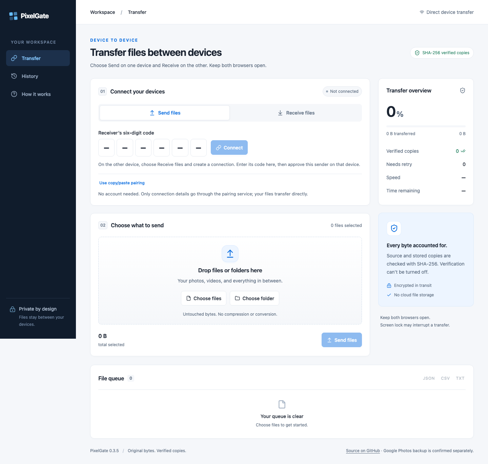
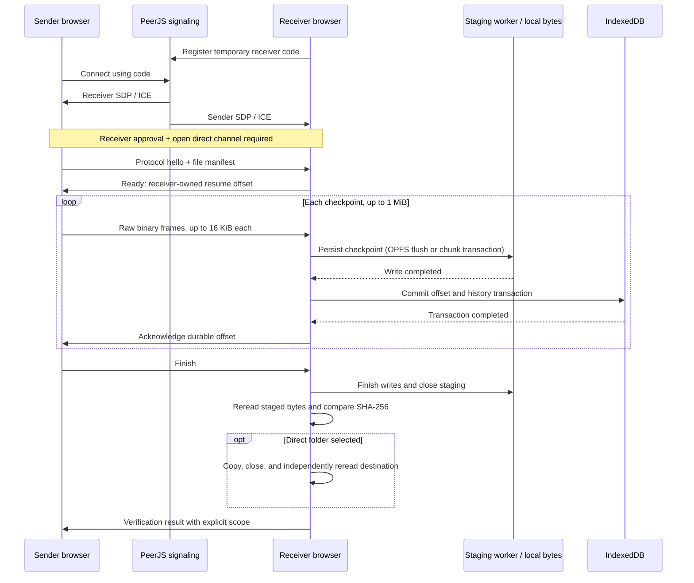

<div align="center">
  
  <h1>PixelGate</h1>
  <p><strong>Move files. Keep every byte.</strong></p>
  <p>Direct browser-to-browser file transfers with resumable checkpoints and independent SHA-256 readback.</p>
  <p>
    <a href="https://s4lmon778.github.io/PixelGate/">Live app</a> ·
    <a href="#quick-start">Quick start</a> ·
    <a href="#engineering-decisions">Engineering decisions</a> ·
    <a href="VALIDATION.md">Validation record</a> ·
    <a href="https://github.com/s4lmon778/PixelGate/issues">Report an issue</a>
  </p>
  <p>
    <a href="LICENSE"></a>
    
    
    
    
  </p>
</div>



PixelGate transfers files between computers, phones, and tablets without a native app or account. The receiver writes the original bytes, closes the stored file, and independently rereads it before comparing SHA-256 hashes. Transfer progress, persisted checkpoints, and verification of the final saved copy are tracked separately.

The application is a static TypeScript/React build hosted on GitHub Pages. PeerJS exchanges connection metadata for six-digit pairing; file payloads travel over a direct encrypted WebRTC data channel. Manifests, filenames, hashes, file bytes, and transfer history stay on the participating devices.

> **Status:** experimental, with reproducible integrity and browser tests. Compatibility depends on browser capabilities, device storage, and network conditions. Real files above 4 GB and 100 GB sessions require further hardware validation. See [validation and boundaries](#validation-and-boundaries).

## Contents

- [Quick start](#quick-start)
- [Features](#features)
- [Architecture](#architecture)
- [Engineering decisions](#engineering-decisions)
- [Validation and boundaries](#validation-and-boundaries)
- [Troubleshooting](#troubleshooting)
- [Local development](#local-development)
- [Deployment](#deployment)
- [Contributing and security](#contributing-and-security)

## Quick start

1. Open **[PixelGate](https://s4lmon778.github.io/PixelGate/)** on both devices, using the same trusted local network or a hotspot.
2. On the destination device, choose **Receive files**, optionally choose a destination folder, and click **Create a connection**.
3. On the sender, enter the receiver's **six-digit code** or scan its QR code, then click **Connect**. Leading zeroes are valid; use **Enlarge QR code** if needed.
4. On the receiver, click **Approve sender** for your intended device. No sender response needs copying.
5. Select files or folders on the sender and click **Send files**. Keep both browsers open and foregrounded.
6. Save the verified copies. For manual downloads, reselect the saved files through **Verify saved copies** to confirm their exported bytes.

Codes expire after ten minutes and are released when the approved connection activates. One sender is accepted per receiver. Six digits are a convenient lookup, not identity authentication: share a code only with your intended device and approve only its request.

### Saving options

| Mode            | Storage workflow                                                                       | Verification of the saved copy                                                           |
| --------------- | -------------------------------------------------------------------------------------- | ---------------------------------------------------------------------------------------- |
| Direct folder   | Copy verified staged bytes into a user-selected folder, where browser support permits. | Close the destination writer, reread the destination file, and compare size and SHA-256. |
| Manual download | Download verified browser copies and move them to the desired folder.                  | Mark the downloaded copy as pending until the user reselects it for hash verification.   |

Choose a destination that fits your workflow: a Documents folder, an archive directory, Downloads, or a media folder. If you use a photo library, document manager, or backup service, import or sync the saved files through that app and confirm backup there. For example, Android users importing photos can choose `DCIM/PixelGate` and configure that folder in Google Photos. PixelGate never reports backup success or deletes source files.

## Features

- **Pairing and consent:** six-digit entry, short QR links, explicit receiver approval, expiry, and immediate revocation. Optional copy/paste pairing works without PeerJS.
- **File and folder queues:** multiple selection, recursive folder drops where supported, preserved relative paths and Unicode names, and rejection of unsafe destination paths.
- **Integrity and recovery:** incremental hashing, independent stored-file readback, durable checkpoints, and resume after source reselection and rehashing.
- **Saving and duplicate handling:** destination readback, verified duplicate detection, numbered filenames for conflicting content, and retained staged copies for retry.
- **Session controls:** pause, resume, cancel, byte progress, local history, and downloadable JSON, CSV, and text reports.
- **Batch management:** export up to 50 pending verified files per click, verify saved copies, and clear eligible staging to reclaim space.
- **Accessible interface:** responsive layouts, mobile-sized controls, keyboard focus, system light/dark mode, and reduced-motion support.

## Architecture

The UI coordinates pairing and queue actions; the transfer engine owns protocol state; dedicated workers handle incremental hashing and checkpoint writes through OPFS or local IndexedDB chunk storage.

| Layer       | Implementation                               | Responsibility                                                                       |
| ----------- | -------------------------------------------- | ------------------------------------------------------------------------------------ |
| Interface   | React, strict TypeScript, CSS                | Send/Receive modes, approval, progress, saving, history, and reports                 |
| Connection  | WebRTC, bundled PeerJS                       | SDP/ICE signaling, ordered raw data channels, connection lifecycle, and consent gate |
| Integrity   | Web Workers, bundled `hash-wasm`, Web Crypto | Incremental SHA-256 and content/path identities                                      |
| Persistence | OPFS, synchronous access handles, IndexedDB  | Staged bytes, committed offsets, local records, and session history                  |
| Tooling     | Vite, ESLint, Prettier, Vitest, Playwright   | Static builds, code checks, failure fixtures, and browser integration tests          |
| Hosting     | GitHub Pages                                 | HTTPS delivery of the application and worker bundles                                 |



Signaling disconnects after activation while the direct channel remains open. The static host and pairing service do not carry the transfer protocol or file payloads. Cloudflare and Google STUN discover network routes; no TURN relay is configured.

For the detailed connection lifecycle and storage model, see [Architecture](docs/ARCHITECTURE.md).

## Engineering decisions

### 1. Bound the transfer pipeline and apply backpressure

The versioned `Control` discriminated union separates JSON control messages from binary file frames. A `hello` handshake precedes manifests and payloads; the sender validates receiver offsets and checkpoint acknowledgments before advancing.

| Mechanism           | Current behavior                                                  | Reason                                                                               |
| ------------------- | ----------------------------------------------------------------- | ------------------------------------------------------------------------------------ |
| File concurrency    | One active transfer; one subsequent file hashes ahead             | Overlap preparation with transfer while limiting payload work                        |
| Hashing reads       | Incremental 1 MiB slices in a worker                              | Hash large sources without allocating the entire file on the UI thread               |
| Transport frames    | Maximum 16 KiB                                                    | Bound each data-channel message and validate incoming frame sizes                    |
| Sender backpressure | Wait while `bufferedAmount` exceeds 512 KiB                       | Avoid continuously feeding a slower receiver or network                              |
| Durable checkpoints | Up to 1 MiB, with acknowledgment before the next block            | Bound unacknowledged payload and make restart offsets explicit                       |
| Receiver dispatch   | Serialized processing; close if more than 160 messages are queued | Prevent asynchronous writes from reordering the receive stream and bound queued work |

These bounds concern payload processing, not total browser memory: queue metadata, runtime overhead, and browser-managed buffers still consume resources. Throughput depends on hashing, storage, the browser, and the network; the repository does not claim an unmeasured performance target.

**Code:** [protocol types and constants](lib/bridge/model.ts), [sender/receiver engine](lib/bridge/transfer.ts), [incremental hash worker](lib/bridge/hash.worker.ts).

### 2. Acknowledge persisted progress, not just received bytes

Checkpoint acknowledgment follows this order on browsers with synchronous OPFS:

```text
OPFS write -> access-handle flush -> IndexedDB transaction commit -> ACK(offset)
```

OPFS and IndexedDB are separate persistence systems, not a single atomic transaction. Writing bytes before committing metadata allows recovery to truncate an uncommitted tail to the last retained checkpoint. On reconnection, the sender reselects and rehashes its sources; the receiver checks the retained staged file and supplies the resume offset. Missing partials or files shorter than the committed offset restart instead of trusting a history entry. Complete-file readback still determines final integrity.

Older browsers use a capability-selected IndexedDB fallback. The staging worker commits each checkpoint as a Blob with its stored byte length in one transaction, requesting `strict` durability when supported. Only after that transaction completes does the receiver commit the manifest offset/history and acknowledge it. The byte store is separate from manifest history; reconnection removes uncommitted tails in a transaction and rejects missing or noncontiguous chunks. Readback constructs a File from stored Blobs, then hashes 1 MiB slices; the application does not concatenate a whole file into a JavaScript byte array. Browser memory use and quota still require device testing.

Preflight writes and independently rereads a full 1 MiB checkpoint before registering a receiver. An absent file-system API or unsupported synchronous access triggers compatibility storage; denied access, quota exhaustion, or failed readback blocks receiving rather than silently claiming a usable backend. Existing staged copies are found in either backend, including after a browser upgrade. Downloads and reselected-export verification work with both storage modes.

File identity is derived from content and path:

```text
fileId = SHA-256(UTF-8(sourceSha256 + "\n" + relativePath))
```

Changed source bytes receive a different identity. A retained verified file is skipped only after its stored bytes are reread and match. Receiver file records and their corresponding history entries are written in the same IndexedDB transaction.

**Code:** [identity derivation](lib/bridge/hash.ts), [staging worker](lib/bridge/staging.worker.ts), [chunk storage](lib/bridge/indexed-staging.ts), [manifest transactions](lib/bridge/database.ts). **Regression evidence:** [interruption and resume tests](tests/transfer.test.ts), [real IndexedDB recovery and quota tests](tests/browser/indexed-staging.spec.ts).

### 3. Model integrity as a property of a specific copy

`RecordFile` separates transfer `phase` from verification `scope`: `none`, `browser`, `destination`, or `exported`. Receiving all bytes is not enough to mark a copy verified.

- **Browser scope:** flush and close the staged file, reread its actual bytes, and compare size and SHA-256 against the source manifest. A mismatch removes the invalid staged copy and blocks saving.
- **Destination scope:** revalidate staged bytes, copy them through a destination writer, close it, and independently hash the saved file. A destination failure retains verified staging for retry.
- **Exported scope:** download initiation leaves verification pending. A reselected saved file must match before the exported copy is marked verified.

Incoming manifests cannot assign their own verification status: receiver validation resets phase, scope, offsets, and destination state. Existing destination files are skipped only after size/hash readback; conflicting content receives a numbered filename. Relative paths reject traversal, absolute paths, control characters, and ambiguous separators before filesystem access.

**Code:** [record validation](lib/bridge/model.ts), [saving and readback](lib/bridge/storage.ts). **Regression evidence:** [corruption and path tests](tests/core.test.ts), [destination/export tests](tests/storage.test.ts).

### 4. Make asynchronous connection failures reproducible

An ICE candidate can arrive before the peer's remote description is installed. In PeerJS 1.5.5, independently dispatched `ANSWER` and `CANDIDATE` messages could cause an early `addIceCandidate()` rejection to abort negotiation.

The per-connection `CandidateInbox` queues candidates until SDP is ready, deduplicates them, serializes additions, and accepts at most 64 distinct candidates. An unusable route records a fixed error category while subsequent routes continue. Activation, failure, and revocation clear queued work and remove listeners.

A browser fixture deliberately delivers candidates before the answer. It reproduced the 0.3.3 failure (`have-local-offer`, missing remote description), then verified that the corrected flow connects, transfers hash-checked bytes, and consumes the code in Chromium, Firefox, and WebKit-to-Chromium. This is a regression for a specific race, not a claim that every network failure is recoverable.

**Code:** [candidate queue](lib/bridge/candidate-inbox.ts), [PeerJS integration](lib/bridge/code-connection.ts). **Regression evidence:** [queue lifecycle tests](tests/candidate-inbox.test.ts), [browser fault injection](tests/browser/bridge.spec.ts), [baseline reproduction](VALIDATION.md).

### 5. Keep trust boundaries and resource limits explicit

Code pairing validates protocol metadata and reliable ordering, admits one sender, and gates the transfer engine behind receiver consent and a connection-bound nonce. Registration retries, inbound pairing requests, route attempts, and candidate queues are bounded. Codes expire after ten minutes; route setup times out after 45 seconds; revocation destroys the local peer.

The copy/paste fallback uses a versioned compressed SDP envelope with matching session/expiry checks, bounded token length, a fixed decompression output buffer, and data-channel-only SDP validation. Only connection descriptions are compressed; media bytes remain untouched.

A Content Security Policy constrains scripts, workers, and signaling origins. Local diagnostics retain connection states, candidate counts, statistics-read outcomes, and fixed error categories; they exclude raw SDP, IP addresses, codes, filenames, and error text. No analytics or automatic diagnostics upload is configured.

The signaling broker is a trust dependency. A six-digit code and SHA-256 do not authenticate a person, and local browser storage is not an encrypted vault. Application-side bounds do not provide global rate limiting for the public PeerJS service. See [Security](SECURITY.md) for the full threat model.

**Code:** [pairing envelope](lib/bridge/pairing.ts), [SDP validation](lib/pairing-validation.ts), [privacy-limited diagnostics](lib/bridge/route-diagnostics.ts), [CSP](index.html).

## Validation and boundaries

Recorded for **0.3.7 on October 6, 2026** across full and targeted runs; these are completed checks, not a continuously updated CI badge.

| Evidence                                         | Coverage                                                                                                                                                                                                 |
| ------------------------------------------------ | -------------------------------------------------------------------------------------------------------------------------------------------------------------------------------------------------------- |
| TypeScript, ESLint, production build             | Strict type checks, linting, and deployable static assets                                                                                                                                                |
| 85 unit/integration tests                        | Independent hashes, corruption, changed sources, resume checkpoints, duplicate conflicts, permission/quota failures, safe paths, pairing lifecycle, and publishing behavior                              |
| 25 passing browser scenarios; 5 deliberate skips | Real WebRTC transfers, consent, ICE race/discovery injection, compatibility storage, checkpoint rollback, corruption, export verification, refresh recovery, QR decoding, mobile layout, and text sizing |
| Chromium 101 compatibility checks                | Actual older engine, public PeerJS pairing, local chunk storage, independently verified bytes, downloads, refresh, corruption rejection, and quota-failure rollback                                      |
| Live GitHub Pages + public PeerJS check          | Code pairing, explicit approval, independently verified staged bytes, and consumed-code rejection                                                                                                        |
| Physical-device report                           | User-confirmed completed iPhone-to-Mac transfer over a Personal Hotspot; original Wi-Fi still failed                                                                                                     |

Browser tests compare synthetic source and staged bytes against independently computed Node/Web Crypto hashes. QR tests decode rendered output with `jsQR`, and request inspection checks that signaling contains no fixture filenames or hashes. Publishing tests use isolated local Git remotes to check committed-source requirements, deployment history preservation, and source-commit provenance.

### Supported environments

| Environment               | Evidence and remaining limits                                                                                                                       |
| ------------------------- | --------------------------------------------------------------------------------------------------------------------------------------------------- |
| Desktop Chromium          | Automated sending/receiving; folder-save readback is unit-tested and feature-detected                                                               |
| Desktop Firefox           | Automated sending/receiving; use downloads where folder access is unavailable                                                                       |
| WebKit test engine        | Automated sender-to-Chromium interoperability; does not certify native Safari receiving                                                             |
| iPhone Safari to Mac      | User-reported hotspot completion; exact iPhone version, final Mac browser, transfer size, and independently checked exported hash were not recorded |
| First-generation Pixel XL | Receiving was blocked by missing newer storage APIs; the compatibility fix is engine-tested, with physical-device validation pending                |

Receiving uses synchronous OPFS when available and IndexedDB Blob checkpoints otherwise. The receiver must pass a real local write/read test before pairing. Folder access is optional; use verified downloads and reselect the exported files for final verification where folder saving is unavailable. Compatibility storage may be slower, particularly on older devices; start with small batches and keep the browser open. Clearing site data or browser eviction can remove staged bytes in either mode.

The production syntax target includes Chrome 92, Firefox 95, and Safari 15.4; this is not certification of every version or device. Chromium 101 engine testing is recorded in [VALIDATION.md](VALIDATION.md). The actual first-generation Pixel's browser version, transfer capacity, and saving behavior still require physical validation. HTTPS is required except for trusted localhost development. Browser suspension, network isolation, host-address privacy, or NAT restrictions can prevent a direct connection.

A **5 GB manifest** test is not a **5 GB byte transfer**, and a **10,000-path manifest** test is not a completed 10,000-file session. Large sessions, files above 4 GB, actual quota exhaustion, and device-specific saving behavior require real hardware validation. Browser picker bytes are the source of truth: original Apple Photos resources, complete Live Photo pairing, iCloud-original retrieval, native media scanning, atomic rename, and filesystem timestamp restoration are outside this version.

Full test conditions, browser versions, physical-device results, and remaining validation work are in [VALIDATION.md](VALIDATION.md).

## Troubleshooting

### Pairing succeeds but the direct connection times out

Confirm both devices use the current app version. Connection details are exchanged automatically; normal six-digit pairing requires no IP lookup. Diagnostics expose candidate delivery and route states without exporting addresses.

Use the same exact network on both devices. For example, a campus's guest and protected networks can have different routing and access policies. Guest, campus, hotel, and workplace Wi-Fi may allow internet access while blocking local discovery or connections between devices; sharing a network name does not guarantee reachability. A completed transfer on a hotspot but not on another network supports a network-dependent restriction, without identifying the exact policy.

Timeout messages automatically distinguish incomplete description exchange, rejected candidates, and a failed direct route. If both configured STUN services report error 701 and no local server-reflexive candidate was gathered, the message also reports their unreachability. These observations cannot establish which router or firewall rule is responsible. Ask the network administrator whether local mDNS discovery and direct WebRTC UDP traffic between your devices are allowed, or use a trusted network that permits local connections. PixelGate cannot change network access rules. No TURN relay is configured. Specific hardware and network observations are recorded in [VALIDATION.md](VALIDATION.md).

For advanced local-discovery diagnosis, the receiver can revoke the failed connection and enter the **sender's local IPv4 address** under **Advanced network settings** before creating a fresh code. Find the address in the sending device's network settings for its current Wi-Fi or wired connection. The address is used locally to try the negotiated UDP application port; it is not added to pairing metadata, history, or exported reports. This optional route cannot bypass blocked device traffic or provide IPv6-only connectivity. Normal ICE signaling already exchanges network information.

### What does “Estimated staging space” mean?

It is the browser-reported quota minus estimated usage for the site's origin, not reserved free disk space. Estimates vary across browsers, profiles, and devices; actual free disk space may be lower. Each file must fit alongside copies still staged in that browser, with headroom for checkpoints and records.

For larger collections of documents, media, archives, or other files, work in batches: save or download the files, verify the saved copies, then choose **Clear verified staging** to make room for the next batch. Direct folder mode retains staging until cleared, so allow disk space for both staged and destination copies. The estimate does not measure destination-folder free space or limit how much the sender can select. Clearing site data or browser eviction can remove staged files and history.

### How do I resume an interrupted transfer?

Create a fresh receiver connection, pair again, reselect the same source files, and send. The receiver reconciles retained checkpoints. Changed sources start a separate transfer; verified files are skipped only when their stored copies remain available and pass readback.

### What if the pairing service is unavailable?

Choose **Use copy/paste pairing** before creating a connection. This exchanges complete SDP descriptions through links and a copied sender response without PeerJS. It still requires a working direct WebRTC route.

## Local development

Requires **Node.js 22.13+** and npm.

```sh
git clone https://github.com/s4lmon778/PixelGate.git
cd PixelGate
npm ci
npm run dev
```

Open `http://127.0.0.1:8787`. Use separate browser profiles for sender and receiver tests.

| Command                | Purpose                                            |
| ---------------------- | -------------------------------------------------- |
| `npm run check`        | TypeScript, ESLint, and unit/integration tests     |
| `npm run build`        | Production static build                            |
| `npm run test:browser` | Real peer transfers and browser integration checks |
| `npm start`            | Serve the production build locally                 |
| `npm run format:check` | Check repository formatting                        |

Install browser binaries with `npx playwright install chromium firefox webkit` before browser tests. Playwright starts a production preview when needed; build first. Automated six-digit connection fixtures use an isolated PeerServer and normal browser privacy defaults. Manual-pairing and compatibility-storage fixtures expose LAN candidates to separate persistence tests from mDNS discovery. Those test settings do not certify native browser networking.

An existing older Chromium executable can be selected for compatibility checks. With public signaling, the pairing fixture retains normal host-address privacy and tests the browser's real storage capabilities rather than disabling OPFS artificially:

```sh
PIXELGATE_TEST_CHROMIUM_EXECUTABLE="/path/to/Chromium" \
PIXELGATE_TEST_PUBLIC_SIGNALING=1 \
npm run test:browser -- --project=chromium --grep compatibility
```

### Repository map

```text
src/                         React UI, QR/code controls, responsive styles
lib/bridge/
  code-connection.ts         PeerJS pairing, approval gate, lifecycle
  candidate-inbox.ts         Bounded ICE queue and serialized delivery
  transfer.ts                Sender/receiver protocol and backpressure
  model.ts                   Protocol types, file states, path validation
  hash.ts / hash.worker.ts   Identity derivation and incremental hashing
  storage.ts                Staging API, destination/export readback
  staging.worker.ts         Serialized OPFS / chunk checkpoint writes
  indexed-staging.ts        Transactional IndexedDB Blob fallback
  database.ts               IndexedDB checkpoints and local history
  route-diagnostics.ts      Local connection report without raw addresses
lib/pairing-validation.ts    Bounded data-channel SDP validation
scripts/deploy-pages.mjs     Static publishing and source provenance
tests/                      Unit/integration and real browser fixtures
docs/                       Architecture, deployment, and screenshots
```

## Deployment

Any HTTPS static host can serve `dist/`. The default code-pairing service requires no API key or backend account; deployments still depend on its availability. Relative asset paths include worker bundles, allowing project subpaths such as `/PixelGate/`.

For GitHub Pages:

1. Fork or clone the repository and configure your `origin` remote.
2. Install dependencies, run checks, and commit your source.
3. Run `npm run deploy:pages`.
4. In **Settings → Pages**, select **Deploy from a branch**, branch **gh-pages**, folder **/(root)**.

The publisher builds locally, preserves `gh-pages` history without force-pushing, and records the source commit and application version in `build.json`. Source pushes to `main` alone do not publish the app.

A custom TLS-enabled PeerServer can be selected with `VITE_PIXELGATE_SIGNAL_URL` at build time; Vite updates the allowed HTTPS/WSS signaling origins in the CSP. There is no cloud media backend. Moving to another origin does not migrate stored transfers or history. See [Deployment](docs/DEPLOYMENT.md) for configuration and verification steps.

### External services and privacy

| Service                        | Information it receives                                                                                                    |
| ------------------------------ | -------------------------------------------------------------------------------------------------------------------------- |
| GitHub Pages / static host     | Ordinary website and asset requests; PixelGate sends no file payloads, manifests, hashes, history, or pairing tokens to it |
| PeerJS / configured PeerServer | Temporary peer IDs, SDP, ICE candidates, and ordinary network information; no transfer manifests or file payloads          |
| Cloudflare / Google STUN       | Connection and network information used to discover routes; no file payloads                                               |

QR links place the code in a URL fragment, which is excluded from the HTTP request and removed after import. Copied connection descriptions contain network addresses and credentials; treat active codes, links, and responses as temporary secrets. Shared-service logs, availability, and global limits are outside this application's control.

## Contributing and security

Focused issues and pull requests are welcome. Include device/browser versions, reproducible steps using synthetic files, and the failing stage: pairing, transfer, verification, or saving. Integrity and recovery changes should include independent readback or fault-injection evidence.

- [Contributing guide](CONTRIBUTING.md)
- [Security assumptions and vulnerability reporting](SECURITY.md)
- [Detailed architecture](docs/ARCHITECTURE.md)
- [Deployment guide](docs/DEPLOYMENT.md)

## License

[MIT](LICENSE) © 2026 s4lmon778. Bundled dependencies retain their respective licenses.
