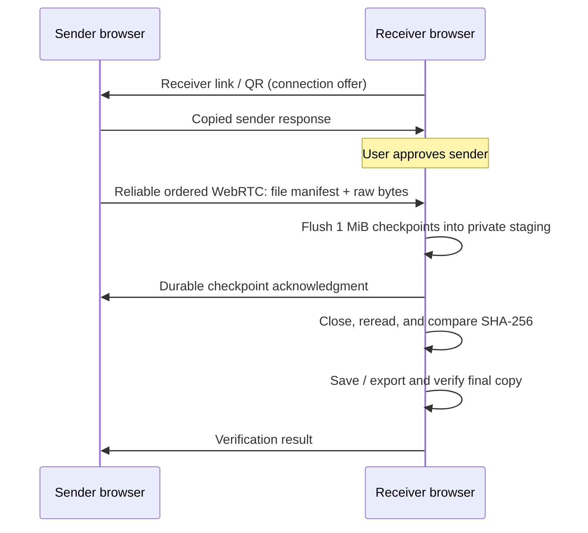

<div align="center">
  
  <h1>PixelGate</h1>
  <p><strong>Move files. Keep every byte.</strong></p>
  <p>Direct browser-to-browser transfers with independent SHA-256 verification.</p>
  <p>
    <a href="https://s4lmon778.github.io/PixelGate/">Open PixelGate</a> ·
    <a href="#quick-start">Quick start</a> ·
    <a href="docs/ARCHITECTURE.md">Architecture</a> ·
    <a href="https://github.com/s4lmon778/PixelGate/issues">Report an issue</a>
  </p>
  <p>
    <a href="LICENSE"></a>
    
    
    
  </p>
</div>


PixelGate transfers files between computers, phones, and tablets through their browsers. File bytes travel directly over encrypted WebRTC. The receiver closes and rereads each completed file, then compares its SHA-256 hash with the source.

**No account. No native app. No cloud media storage.** The public app is hosted on GitHub Pages. Pairing happens by exchanging a receiver link and sender response, so there is no signaling backend to operate.

> **Experimental:** automated integrity and browser tests are included. Native Safari, iPhone, the first-generation Pixel XL, real files above 4 GB, and 100 GB sessions still require physical-device validation. See [the validation record](VALIDATION.md).

## Features

- **Untouched file bytes:** no transcoding, resizing, or compression of media.
- **Independent verification:** source, browser-staged, destination-folder, and reselected exported copies have distinct verification scopes.
- **Resumable transfers:** 1 MiB durable checkpoints; reconnect and reselect the source files after interruption.
- **Files and folders:** multiple selections, recursive folder drops where supported, relative paths, and Unicode names.
- **Safe saving:** reread duplicates before skipping; preserve different content with numbered filenames.
- **Practical controls:** pause, resume, cancel, progress, local history, and JSON/CSV/text reports.
- **Batch workflows:** export up to 50 pending verified files per click, verify exported copies, then clear staging.
- **Accessible layout:** large mobile controls, keyboard focus, system light/dark mode, and reduced-motion support.
- **Self-hostable:** a static build with no database, API keys, or backend accounts.

## Quick start

1. Open **[PixelGate](https://s4lmon778.github.io/PixelGate/)** on both devices. Keep them on the same trusted Wi-Fi network.
2. On the destination device, choose **Receive files**, optionally choose a destination folder, and click **Create a connection**.
3. On the sending device, scan the receiver QR code or paste its link. Use **Enlarge QR code** on the receiver if the camera has trouble reading it; keep the entire white border visible. Click **Prepare sender response**.
4. Copy that response back to the original receiver tab. Paste it and click **Approve sender**.
5. Select files or folders on the sender, then click **Send files**. Keep both tabs open.
6. Save the verified copies. For manual downloads, reselect the saved files through **Verify saved copies**.

Pairing links expire after ten minutes. Share the link and response only between your own participating devices, through a trusted channel. Revoking closes the local peer connection immediately. Creating a new link makes old responses unusable.

### Saving modes

| Mode            | What happens                                                                    | Final verification                                           |
| --------------- | ------------------------------------------------------------------------------- | ------------------------------------------------------------ |
| Direct folder   | Choose a folder when supported. PixelGate copies verified staged bytes into it. | The destination file is closed and independently reread.     |
| Manual download | Download verified browser copies and move them where you want.                  | The exported copy stays pending until reselected and hashed. |

On Android, `DCIM/PixelGate` is a suggested destination. Google Photos visibility and backup must be enabled and confirmed in Google Photos. PixelGate never reports backup success or deletes source media.

### Recover an interrupted transfer

Create a new receiver link, pair again, reselect the same source files, and send. The receiver reconciles durable checkpoints and resumes retained partial copies. Changed source content receives a new identity. Previously verified files are skipped only after their available stored bytes are reread and match.

## How it works



Incremental SHA-256 runs in a worker using bundled `hash-wasm`. One file transfers while one subsequent file hashes ahead. Transport frames are 16 KiB, with bounded sender buffering. IndexedDB stores local manifests and history; Origin Private File System (OPFS) stores partial and complete staged copies.

Pairing tokens contain a version, random session ID, expiry, and WebRTC connection description. They are compressed to make links and QR codes practical; **media bytes are never compressed**. The receiver validates the response against its active offer before approving one sender.

## Privacy and network behavior

- GitHub Pages serves the app and static assets. It receives normal website requests, including visitor network information; it receives no file bytes, filenames, hashes, transfer history, or pairing tokens from PixelGate.
- Pairing data stays in the link’s URL fragment or copied response. Fragments are not part of the HTTP request. PixelGate removes an imported fragment from the address bar.
- Pairing descriptions include network addresses and connection credentials. Treat links and responses as temporary secrets; do not post them publicly.
- Cloudflare STUN helps discover network routes. No TURN relay is configured. STUN receives network information, not your files.
- Browser storage is local to the site’s origin. Clearing site data or browser eviction can remove partials and local history. Switching from another host does not migrate its stored transfers.
- There is no analytics, application account system, or cloud media store. See [SECURITY.md](SECURITY.md) for security assumptions and reporting guidance.

## Browser support and boundaries

| Environment               | Sending                      | Receiving                | Direct folder saving                             |
| ------------------------- | ---------------------------- | ------------------------ | ------------------------------------------------ |
| Desktop Chromium          | Automated                    | Automated                | Feature-detected; unit-tested readback           |
| Desktop Firefox           | Automated                    | Automated                | Use downloads where picker access is unavailable |
| WebKit test engine        | Automated sender to Chromium | Not certified            | Native Safari testing pending                    |
| iPhone / iPad Safari      | Physical testing pending     | Physical testing pending | Manual download fallback                         |
| First-generation Pixel XL | Physical testing pending     | Physical testing pending | Verify on the actual Android/browser version     |

Receiving requires OPFS with synchronous worker access. Unsupported browsers are blocked before pairing. HTTPS is required, except for trusted localhost development. Network-isolated guest Wi-Fi, VPNs, or NAT restrictions may prevent a direct connection. Keep both tabs foregrounded; backgrounding or screen lock can interrupt transfers.

Browser quota and device free space determine session capacity. Direct folder mode still stages each file before saving it, so allow space for staging and its destination copy. Export, verify, and clear batches rather than assuming unlimited storage.

Integrity covers the bytes supplied by a browser picker. Original Apple Photos resources, complete Live Photo pairing, iCloud-original retrieval, native media scanning, atomic rename, and restoration of filesystem modification dates are outside this version. Embedded metadata remains unchanged when it is part of the selected file.

## Development

Requires **Node.js 22.13+** and npm.

```sh
git clone https://github.com/s4lmon778/PixelGate.git
cd PixelGate
npm ci
npm run dev
```

Open `http://127.0.0.1:8787`. Use separate browser profiles for sender and receiver tests.

```sh
npm run check                      # TypeScript, ESLint, unit/integration tests
npm run build                      # Production static bundle
npx playwright install chromium firefox webkit
npm run test:browser                # Real peer transfer and layout checks
npm start                          # Serve the production build locally
```

## Deploy your own copy

Fork or clone the repository. Any HTTPS static host can serve `dist/`; no backend configuration is necessary. Builds use relative asset paths, including worker bundles, so project subpaths work.

For GitHub Pages:

1. Create your repository and configure its `origin` remote.
2. Commit the source and run `npm ci`, `npm run check`, then **`npm run deploy:pages`**.
3. In **Settings → Pages**, select **Deploy from a branch**, branch **`gh-pages`**, folder **`/(root)`**.
4. Use the HTTPS URL GitHub provides.

The deployment script builds locally, pushes compiled assets to `gh-pages` without force-pushing, and records the source commit in `build.json`. Repeat it after committing changes. Normal pushes to `main` do not publish automatically. [Full deployment guide →](docs/DEPLOYMENT.md)

## Project structure

```text
src/                  React interface and responsive styles
lib/bridge/           Pairing, WebRTC, hashing, storage, and transfer protocol
lib/pairing-validation.ts
                      Bounded data-channel SDP validation
scripts/              Static publishing tools
tests/                Integrity tests and real browser scenarios
docs/                 Architecture, deployment, and screenshots
```

## Contributing

Issues and focused pull requests are welcome. Include reproduction steps and browser/OS versions. Integrity changes should include independent hashes or corruption/recovery tests. Read [CONTRIBUTING.md](CONTRIBUTING.md) before submitting.

## License

[MIT](LICENSE) © 2026 s4lmon778. Bundled dependencies retain their respective licenses.
