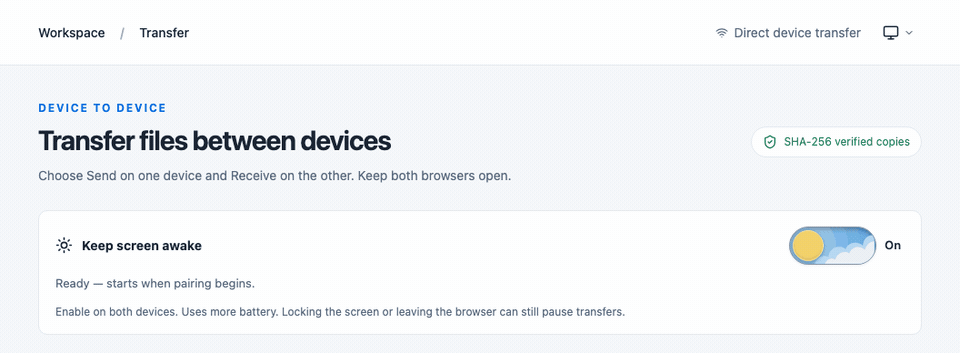
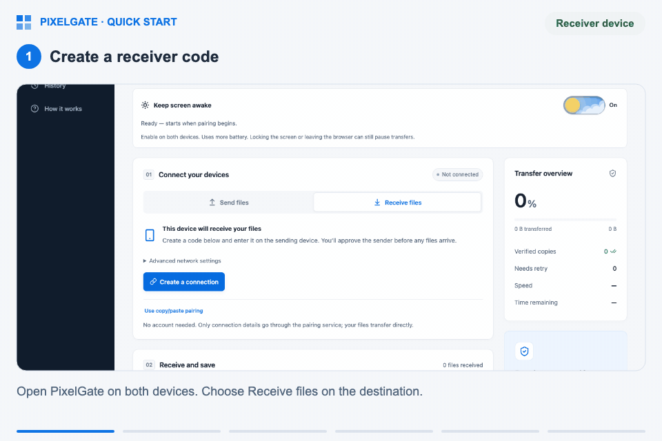
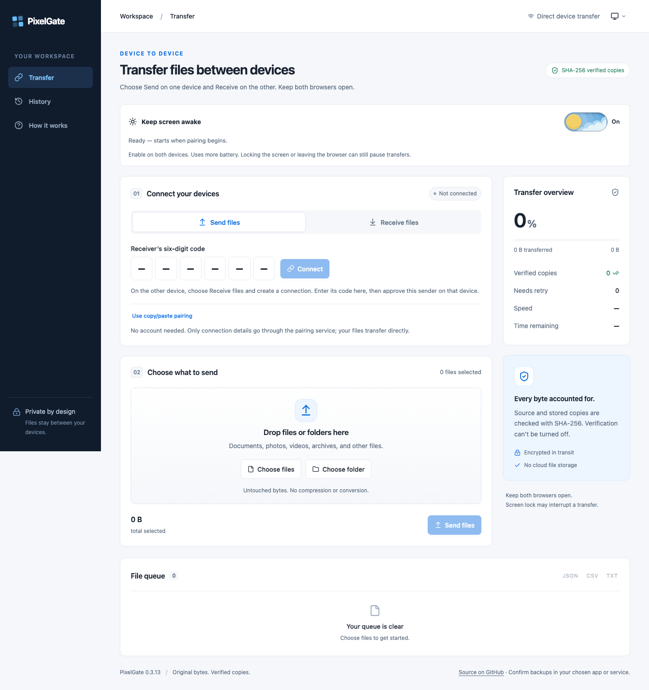
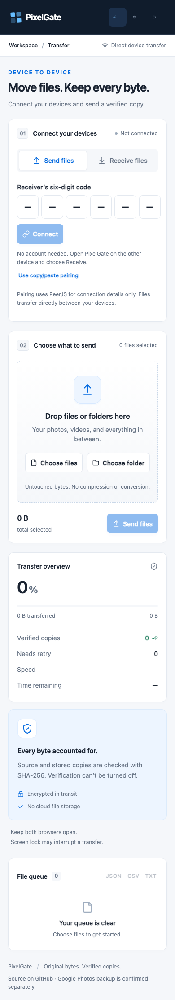
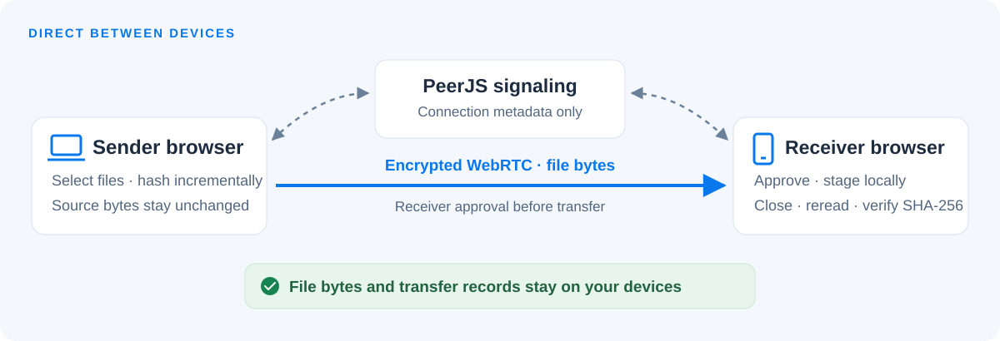
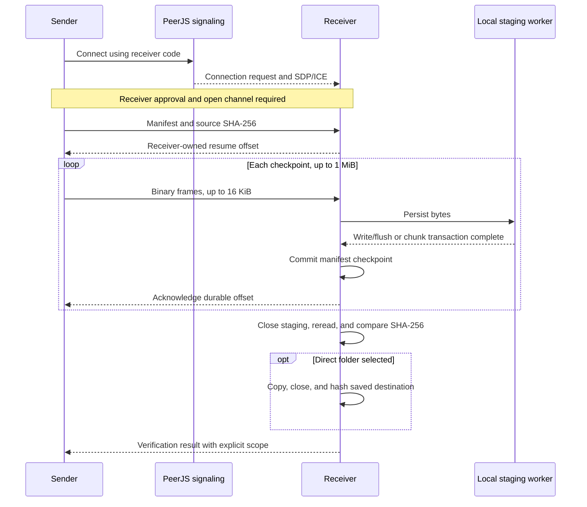
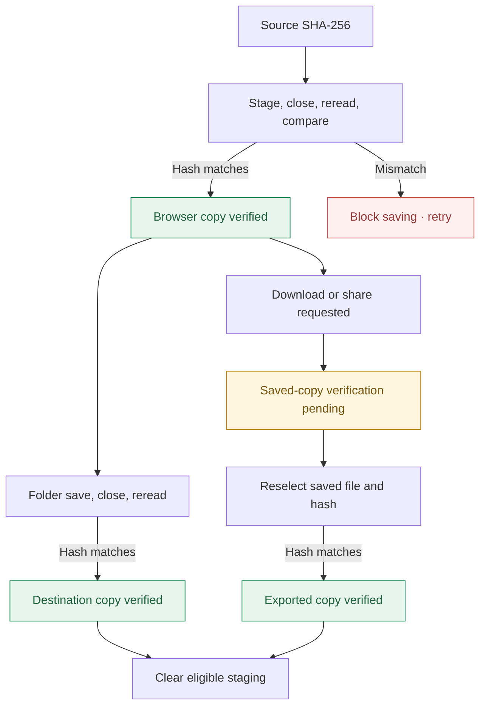

<div align="center">
  
  <h1>PixelGate</h1>
  <p><strong>Move files. Keep every byte.</strong></p>
  <p>Direct browser-to-browser transfers with resumable checkpoints and independent SHA-256 verification.</p>
  <p>
    <a href="https://s4lmon778.github.io/PixelGate/">Live app</a> ·
    <a href="#quick-start">Quick start</a> ·
    <a href="#engineering-decisions">Engineering decisions</a> ·
    <a href="docs/README.md">Documentation</a> ·
    <a href="https://github.com/s4lmon778/PixelGate/issues">Report an issue</a>
  </p>
  <p>
    <a href="LICENSE"></a>
    
    
    
    
  </p>
</div>

PixelGate moves files between computers, phones, and tablets using their browsers. File bytes travel over a direct encrypted WebRTC data channel. The receiver closes and rereads each stored file before comparing its SHA-256 with the source. Filenames, manifests, hashes, file bytes, and transfer history remain on the participating devices.

The app is a static **TypeScript / React / Vite** build hosted on GitHub Pages. **PeerJS** exchanges connection metadata for six-digit pairing; it carries no file payloads. No native app, account, cloud media storage, or TURN relay is required.

> **Status:** experimental. The current app is **0.3.13**. Automated checks exercise integrity and recovery; browser capabilities, available storage, and network policies still determine usability. Large-file and physical-device boundaries are documented below.

<div align="center">
  
  <p><sub>Recorded from the app: the screen-awake preference and appearance controls.</sub></p>
</div>

## Contents

- [Quick start](#quick-start)
- [Features](#features)
- [Architecture](#architecture)
- [Engineering decisions](#engineering-decisions)
- [Validation and boundaries](#validation-and-boundaries)
- [Development](#development)
- [Deployment](#deployment)
- [Documentation and contributing](#documentation-and-contributing)

## Quick start

<div align="center">
  
  <p><sub>A real synthetic-file transfer, with camera zooms and click highlights. Playback is edited for instruction.</sub></p>
</div>

[Watch or download the 29-second video](docs/assets/quick-start.mp4) · [Recording details](docs/assets/README.md#quick-start-walkthrough)

1. Open **[PixelGate](https://s4lmon778.github.io/PixelGate/)** on both devices, using a trusted network that permits connections between them.
2. On the destination device, choose **Receive files**, optionally choose a destination folder, and click **Create a connection**.
3. On the sender, enter the receiver's **six-digit code** or scan its QR code, then click **Connect**.
4. On the receiver, **Approve sender** for your intended device.
5. Select files or folders on the sender and click **Send files**. Keep both browsers open and foregrounded; enable **Keep screen awake** where supported.
6. Save the verified files through a selected folder, **Save to app or location**, or downloads. Reselect downloaded/app-saved copies with **Verify saved copies** to confirm their final bytes.

Codes expire after ten minutes and accept one sender. A code is a temporary lookup, not identity authentication. Same-network-name Wi-Fi can still block local connections; use a permitted network or hotspot if necessary.

For large collections, receive a batch, save it, verify the saved copies, and choose **Clear verified staging** before the next batch. This frees eligible browser storage while keeping downloaded/saved files and transfer records. **Clear history** is a separate action that preserves staging and resume data.

See the [usage guide](docs/USAGE.md) for saving modes and storage behavior, or [troubleshooting](docs/TROUBLESHOOTING.md) for network and browser issues.

<details>
<summary><strong>Interface previews — desktop and mobile</strong></summary>

Screenshots show the 0.3.13 interface with empty queues, including paired saving controls and expandable help.





</details>

## Features

- **Pairing and approval:** six-digit entry, QR links, receiver consent, expiry, and revocation. Copy/paste pairing is available when signaling is unavailable.
- **Files and folders:** multiple selection, recursive drops where supported, Unicode filenames, preserved relative paths, and destination-path validation.
- **Integrity and recovery:** incremental worker hashing, independent stored-file readback, durable checkpoints, and resume after source reselection and rehashing.
- **Saving:** direct folder writes with destination readback, native save/share where supported, verified downloads, duplicate checks, and numbered conflicting filenames.
- **Batch controls:** pause/resume/cancel, progress, export and saved-copy verification, staging cleanup, local history, and JSON/CSV/text reports.
- **Accessible interface:** responsive paired action rows, keyboard controls, Light / Dark / System appearance, reduced-motion support, expandable help, and an optional screen-awake switch.

## Architecture

React coordinates user actions; the transfer engine owns protocol state; workers handle hashing and staging. GitHub Pages serves static assets, while PeerJS handles temporary signaling.



| Layer       | Implementation                             | Responsibility                                                       |
| ----------- | ------------------------------------------ | -------------------------------------------------------------------- |
| Interface   | React, strict TypeScript, CSS              | Pairing, approval, queues, progress, saving, appearance, and reports |
| Connection  | WebRTC, bundled PeerJS                     | SDP/ICE exchange, reliable ordered data channels, and lifecycle      |
| Integrity   | Web Workers, `hash-wasm`                   | Incremental source hashing and independent copy readback             |
| Persistence | OPFS, IndexedDB                            | Staged bytes, checkpoint metadata, local manifests, and history      |
| Tooling     | Vite, ESLint, Prettier, Vitest, Playwright | Static builds, checks, and failure-injection fixtures                |

<details>
<summary><strong>Protocol exchange and checkpoint ordering</strong></summary>



</details>

Signaling disconnects after activation; file transfer continues over the direct channel. STUN discovers potential routes. No TURN fallback is configured. See [Architecture](docs/ARCHITECTURE.md) for protocol controls, lifecycle limits, and compatibility storage.

## Engineering decisions

The design treats persisted progress, completed transfer, and verified saved bytes as separate states.



| Decision                    | Implementation and reason                                                                                                                                                                                | Evidence                                                                                                     |
| --------------------------- | -------------------------------------------------------------------------------------------------------------------------------------------------------------------------------------------------------- | ------------------------------------------------------------------------------------------------------------ |
| Bounded pipeline            | One active file, one hash ahead, 16 KiB frames, 1 MiB checkpoints, and 512 KiB sender backpressure constrain payload work.                                                                               | [Transfer engine](lib/bridge/transfer.ts), [protocol types](lib/bridge/model.ts)                             |
| Acknowledge persisted bytes | Worker write/flush or chunk transaction completes before manifest commit and ACK. Resume truncates uncommitted tails rather than trusting a progress counter.                                            | [Recovery fixtures](tests/transfer.test.ts), [real chunk-store tests](tests/browser/indexed-staging.spec.ts) |
| Capability-tested storage   | A full 1 MiB write/read probe selects usable OPFS or IndexedDB. Blob-cloning restrictions permit a bounded buffer retry after transaction abort; quota and integrity failures do not trigger that retry. | [Preflight tests](tests/staging-preflight.test.ts), [checkpoint store](lib/bridge/indexed-staging.ts)        |
| Copy-specific verification  | Transfer `phase` is distinct from `scope`: `none`, `browser`, `destination`, or `exported`. Download/share initiation leaves final-copy verification pending.                                            | [Record model](lib/bridge/model.ts), [saved-copy tests](tests/storage.test.ts)                               |
| Serialized ICE delivery     | A bounded candidate inbox waits for remote SDP, deduplicates candidates, and serializes additions, preventing an answer/candidate race.                                                                  | [Candidate inbox](lib/bridge/candidate-inbox.ts), [browser fault injection](tests/browser/bridge.spec.ts)    |
| Explicit trust boundaries   | Approval gates the transfer engine; pairing inputs and queues are bounded; path validation rejects unsafe destinations; diagnostics omit raw addresses and file information.                             | [Connection lifecycle](lib/bridge/code-connection.ts), [Security](SECURITY.md)                               |

OPFS and manifest metadata are separate persistence systems. Their ordering supports refresh/reconnect recovery; it does not establish OS power-loss durability. File identity includes both content hash and relative path, and retained verified copies must pass readback before they can be skipped.

Native sharing uses a fresh user tap after file preparation so hashing does not consume transient activation. History clearing affects only the presentation log, preserving recovery records and staged bytes.

The [engineering guide](docs/ENGINEERING.md) explains these tradeoffs with source entry points and regression evidence. The [architecture reference](docs/ARCHITECTURE.md) describes the runtime model.

## Validation and boundaries

Recorded through **0.3.13 on October 7, 2026** across full and targeted runs. These are executed checks, not a continuously updated CI badge.

| Evidence                        | What was checked                                                                                                                                                |
| ------------------------------- | --------------------------------------------------------------------------------------------------------------------------------------------------------------- |
| **103 unit/integration tests**  | Independent hashes, corruption, changed sources, checkpoints, duplicates, unsafe paths, permission/quota failures, pairing lifecycle, and deployment provenance |
| Browser integration             | Real WebRTC transfers, approval, QR decoding, independent stored/exported hashes, interruption and refresh recovery, and corruption rejection                   |
| Interface and capability checks | Mobile/desktop layouts, enlarged text, appearance, native-share fixtures, download bytes, wake-lock lifecycle, and history preservation                         |
| Legacy engine                   | Actual Chromium 101 compatibility storage, public signaling, downloads, checkpoint recovery, and current layout controls                                        |
| Physical-device reports         | Completed iPhone-to-Mac hotspot transfer; receiving, downloading, and opening files on older Pixel/iOS devices                                                  |

Browser tests use synthetic files and independent Node/Web Crypto hashes. Hardware reports lack complete device/version/capacity measurements and are recorded separately from automated engine evidence in [the validation record](docs/VALIDATION.md).

- Receiving must pass a local write/read preflight. Folder access and native share targets depend on the browser and device; downloads remain the fallback.
- Browsers must stay open. Wake lock can prevent automatic screen sleep where supported, but cannot guarantee background execution or survive manual locking and OS suspension.
- Guest, campus, hotel, or workplace networks may block direct connections even when both devices use the same Wi-Fi name. No relay is available to bypass that restriction.
- Browser quotas are estimates, and temporary sessions can discard local data. Real files over 4 GB, 10,000-file sessions, and 100 GB reliability require further hardware validation.
- Picker-supplied bytes are the source of truth. Original Photos resources, complete Live Photo pairing, iCloud-original retrieval, native media scanning, and filesystem timestamp restoration are outside this version.
- PixelGate cannot select an arbitrary photo album or verify external backup. It never reports Google Photos backup success or deletes source media.

## Development

Requires **Node.js 22.13+** and npm.

```sh
git clone https://github.com/s4lmon778/PixelGate.git
cd PixelGate
npm ci
npm run dev
```

Open `http://127.0.0.1:8787`. Use separate browser profiles for local sender/receiver checks.

```sh
npm run check                  # TypeScript, ESLint, unit/integration tests
npm run build                  # Production assets in dist/
npx playwright install chromium firefox webkit
npm run test:browser           # Real peer and browser fixtures
npm run format:check           # Formatting
```

Playwright starts a production preview when needed; build first. See [Development and testing](docs/DEVELOPMENT.md) for fixture assumptions, targeted runs, and selecting an older Chromium executable.

```text
src/                 React components, appearance, responsive styles
lib/bridge/          Pairing, protocol, hashing workers, storage, and reports
lib/                 Shared pairing validation and worker declarations
tests/               Unit/integration fixtures and tests/browser/ scenarios
scripts/             Static publishing and source provenance
docs/                Usage, design, development, deployment, and validation
docs/assets/         Current interface screenshots and project artwork
.github/             Issue forms and pull request template
```

Build output, dependencies, browser reports, and environment files are ignored. Legacy internal `pixelbridge` storage identifiers remain unchanged to preserve compatibility; the public app is PixelGate.

## Deployment

The app can run on any HTTPS static host. For GitHub Pages:

1. Fork or clone the repository and configure your Git `origin`.
2. Install dependencies, run checks, and commit the source.
3. Run `npm run deploy:pages`.
4. Select **Settings → Pages → Deploy from a branch → gh-pages → /(root)**.

The publisher preserves deployment history and writes the app version/source commit to `build.json`. Pushing `main` alone does not publish the site. Relative asset paths support project subpaths such as `/PixelGate/`.

Default pairing uses PeerJS's public signaling service without an API key; shared-service availability and limits remain external dependencies. A TLS-enabled PeerServer can be selected with `VITE_PIXELGATE_SIGNAL_URL`. No application database, media backend, analytics, or TURN service is deployed.

Moving to another origin does not migrate browser files, history, or permissions. See [Deployment](docs/DEPLOYMENT.md) for custom signaling, hosting constraints, and verification steps, and [Security](SECURITY.md) for the trust model.

## Documentation and contributing

The [documentation index](docs/README.md) links the full usage, troubleshooting, architecture, engineering, development, deployment, and validation guides.

Issues and focused pull requests are welcome. Include device/browser versions, synthetic reproduction steps, the failing stage, and relevant validation. Keep private files, pairing secrets, and network addresses out of public reports.

- [Contributing guide](CONTRIBUTING.md)
- [Security assumptions and vulnerability reporting](SECURITY.md)
- [Report a bug](https://github.com/s4lmon778/PixelGate/issues/new?template=bug_report.yml)

## License

[MIT](LICENSE) © 2026 s4lmon778. Bundled dependencies retain their respective licenses.
