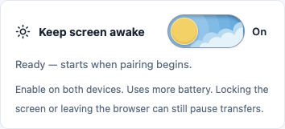

# Using PixelGate

1. Open **[PixelGate](https://s4lmon778.github.io/PixelGate/)** on both devices, using the same trusted local network or a hotspot.
2. On the destination device, choose **Receive files**, optionally choose a destination folder, and click **Create a connection**.
3. On the sender, enter the receiver's **six-digit code** or scan its QR code, then click **Connect**. Leading zeroes are valid; use **Enlarge QR code** if needed.
4. On the receiver, click **Approve sender** for your intended device. No sender response needs copying.
5. Select files or folders on the sender and click **Send files**. Keep both browsers open and foregrounded.
6. Save the verified copies: choose a destination folder before receiving where supported, or use **Save to app or location** afterward. Select the collection, prepare it, then tap **Choose app or save location** to open the device's native options, or **Download verified files** when sharing is unavailable. Reselect files saved through apps or downloads using **Verify saved copies** to confirm their final bytes.

Codes expire after ten minutes and are released when the approved connection activates. One sender is accepted per receiver. Six digits are a convenient lookup, not identity authentication: share a code only with your intended device and approve only its request.

## Saving options

| Mode              | Storage workflow                                                                                                                     | Verification of the saved copy                                                                             |
| ----------------- | ------------------------------------------------------------------------------------------------------------------------------------ | ---------------------------------------------------------------------------------------------------------- |
| Direct folder     | Copy verified staged bytes into a user-selected folder, where browser support permits.                                               | Close the destination writer, reread the destination file, and compare size and SHA-256.                   |
| Native save/share | Select the whole collection; prepare the next fifty, then hand off up to ten compatible files per fresh tap.                         | A handoff is recorded separately; the final saved copy remains pending until reselected and hash-verified. |
| Manual download   | Download the prepared batch or choose Download all selected to continue through the whole collection, fifty files checked at a time. | Mark the downloaded copy as pending until the user reselects it for hash verification.                     |

Choose a destination that fits your workflow: a Documents folder, an archive directory, Downloads, or a media folder. If you use a photo library, document manager, or backup service, import or sync the saved files through that app and confirm backup there. For example, Android users importing photos can choose `DCIM/PixelGate` and configure that folder in Google Photos. PixelGate never reports backup success or deletes source files.

For a Pixel collection, first try **Save to Photos folder** on the receiver. Chrome added Android folder access in version 132; update through the Play Store if the button is unavailable. In the system picker, choose or create **DCIM/PixelGate in internal storage** and grant editing access. The entire verified browser collection saves there without a fifty-file cap, and future transfers save there automatically while this tab remains open. Photos mode uses original filenames in one folder, numbering conflicting names without overwriting existing files; the normal Choose folder action continues preserving source directories. Enable **PixelGate** once in Google Photos' device-folder backup settings. Confirm that Photos sees the saved media and completes backup before freeing phone space. This selects a local device folder; add media to a cloud album inside Photos. [Chromium's Android folder-access rollout](https://groups.google.com/a/chromium.org/g/blink-dev/c/x3IcFv2jY6c/m/ez3Z2Hn8BQAJ), [Chrome folder API guide](https://developer.chrome.com/docs/capabilities/web-apis/file-system-access).

If the browser or Android storage provider cannot write that folder, verified browser copies remain available. Use **Save to app or location → Select all → Prepare selected files → Download all selected** (or **Download verified files** for one prepared batch). Allow multiple downloads if Chrome asks and keep this tab open. The old twenty-file selection limit is removed. All remaining files stay selected across actions.

For a 400 MB video, use a direct Photos device folder where supported, or verified downloads: Chrome on Android limits native file sharing to ten files and 50 MiB per file, even when its capability probe accepts the payload. [Chromium sharing implementation](https://chromium.googlesource.com/chromium/src/+/main/components/browser_ui/webshare/android/java/src/org/chromium/components/browser_ui/webshare/ShareServiceImpl.java).

On the Pixel, open **Google Photos → Collections → On this device → Download**. In **Photos settings → Backup → Back up device folders**, enable **Download** to include downloaded media in backup. Older Photos versions may use **Library** and **Downloads**. Alternatively, use Files to move the media into `DCIM/PixelGate`, then enable that device folder. This is a browser-only route for the whole collection; verify playback and backup in Photos. [Google Photos folder guide](https://support.google.com/photos/answer/6193313?co=GENIE.Platform%3DAndroid&hl=en).

Mobile browsers do not universally expose folder writers or photo-album access. The save dialog stays available after verified files arrive even without native sharing. It rereads and hashes selected copies, then offers downloads with original filenames and media MIME types; missing generic MIME types are inferred from common file extensions without transcoding. In the browser's Downloads list, use the file manager's Share or Move actions where available. Some browsers require permission for multiple downloads. A download request is not proof that saving completed.

On Android, **Open in Chrome** provides a user-tapped link to the full Chrome app when sharing is unavailable. Embedded browsers may lack APIs available in full Chrome. Only the application page is passed; pairing fragments, transfer metadata, and files are excluded. If the browser changes, receive again there because browser storage is separate. This does not add file-sharing support to an unsupported Chrome version or select Google Photos automatically. [Android browser intents](https://developer.chrome.com/docs/android/intents), [Web Share API](https://developer.mozilla.org/en-US/docs/Web/API/Navigator/share).

**Save to app or location** uses Web Share file support when present; your OS and installed apps determine the available destinations and save actions. PixelGate cannot preselect an app or album, remember a share target, or guarantee a specific Photos action. Unsupported types or oversized batches may be rejected by the browser or target app; choose fewer files or use downloads. App sharing flattens paths to filenames, numbers collisions, and passes unchanged staged bytes without transcoding. The selected app can subsequently transform or upload files under its own settings.

**Google Photos albums:** this release does not connect to a Google account or upload through Google's API. Google's Library API can manage albums created by the integrating app, rather than save into arbitrary existing albums; its Picker API selects existing media for reading, not an upload destination. A Google Photos account integration would be a separate, explicit cloud-upload option requiring OAuth configuration. [Google's album restrictions](https://developers.google.com/photos/library/guides/manage-albums), [API changes](https://developers.google.com/photos/support/updates).

## Screen awake and local history

The main-page **Keep screen awake** switch defaults on during pairing and connections, with the preference saved locally. Its status distinguishes a requested lock from an active lock, and reports denial or release. The app reacquires an enabled screen lock when the tab becomes visible again, releases it when switched off or disconnected, and provides a retry action. Unsupported browsers show device screen-timeout guidance.

The sun/cloud and moon/star switch indicates the local **On/Off preference**; the status message beneath it confirms whether a wake lock is actually active. The transition honours reduced-motion settings. Its SVG/CSS artwork is implemented locally, inspired by [Day Night Switch Buttons by Ashish Shakya for Hogoco](https://dribbble.com/shots/15091716-Day-Night-Switch-Buttons), with PixelGate's blue/slate palette and compact controls; no third-party image assets are loaded.

Screen Wake Lock prevents automatic screen lock where supported; it does not keep a browser running after manual locking, app switching, or OS suspension. Power-saving policies may release it. Enable it on both devices and keep both tabs visible. Checkpoint-based reconnection remains the recovery path for interrupted transfers.

In **History**, **Clear history** clears all displayed records or the selected session, with confirmation. It preserves staged bytes, saved copies, and receiver resume manifests. **Clear verified staging** is a separate storage action. Resuming, verifying, or saving retained files can create new history records.

## Storage and large batches

**Estimated staging space** is the browser's estimated site quota minus usage. It is not reserved disk space, a total-session transfer limit, or the free space in your chosen destination. Allow room for files already staged and for saved copies sharing the same disk. Browsers, profiles, and devices can report different allowances.

For a large collection:

1. Receive a batch that fits the available staging space.
2. Save or download the files.
3. Use **Verify saved copies** to reread exported copies; direct folder mode verifies its destination automatically.
4. Choose **Clear verified staging** to remove eligible browser copies and make room for the next batch.

Staging cleanup preserves your saved/downloaded copies, source files, and transfer records. A result of **0 staged copies cleared** means no staged copy was removed. Files with only browser verification remain staged until a saved copy is verified. Google Photos or another app can still use a saved file after its browser staging is removed.

Temporary or Private sessions may discard local bytes when closed. Keep both browsers open during a transfer, and save and verify important files before closing a temporary session. Storage and device limitations are covered in [Troubleshooting](TROUBLESHOOTING.md).

## Interface

- **Choose folder** and **Save to app or location** are paired on mobile. Their availability follows the browser's capabilities and whether verified files exist.
- Extended explanations are under **How storage works**, **Saving options**, and **About saved-copy verification**. Operational instructions, status messages, and errors stay visible.
- The top-bar appearance menu offers **Light**, **Dark**, and **System**, with a locally saved preference.
- Files may be verified at browser, destination-folder, or reselected-export scope; reports keep these scopes separate.

[Back to the project overview](../README.md) · [Documentation index](README.md)

## Pixel albums and unlimited backup

Keep files local to the eligible Pixel first, then let the Google Photos Android app back up the chosen device folder. The Downloads folder can be enabled once in Photos settings → Backup → Back up device folders; it does not have to be moved to DCIM. Confirm the account, backup quality, and Backup complete status in Photos, then select the media and add it to your chosen album. Album organization does not activate the storage benefit.

[Google documents](https://support.google.com/pixelphone/answer/6220791?co=GENIE.Platform%3DAndroid&hl=en) unlimited Original quality backup for the original Pixel, and unlimited Storage saver for Pixel 2–5 under their model-specific terms. Storage saver may compress images or resize videos. A Google Photos API upload counts against Google account storage and is not the local Pixel backup route. [Free up space](https://support.google.com/photos/answer/6128843?co=GENIE.Platform%3DAndroid&hl=en) removes already-backed-up local copies; it does not activate unlimited storage and does not clear PixelGate staging. Use the existing saved-copy verification/clear workflow separately for staged browser copies.

Chrome cannot directly hand an arbitrary-size browser Blob or unlimited file batch to Google Photos. Verified downloads stay available for large originals and whole collections; Google Photos itself documents [backup limits](https://support.google.com/photos/answer/6193313?co=GENIE.Platform%3DAndroid&hl=en), including 10 GB videos and 200 MB / 200 MP photos.
